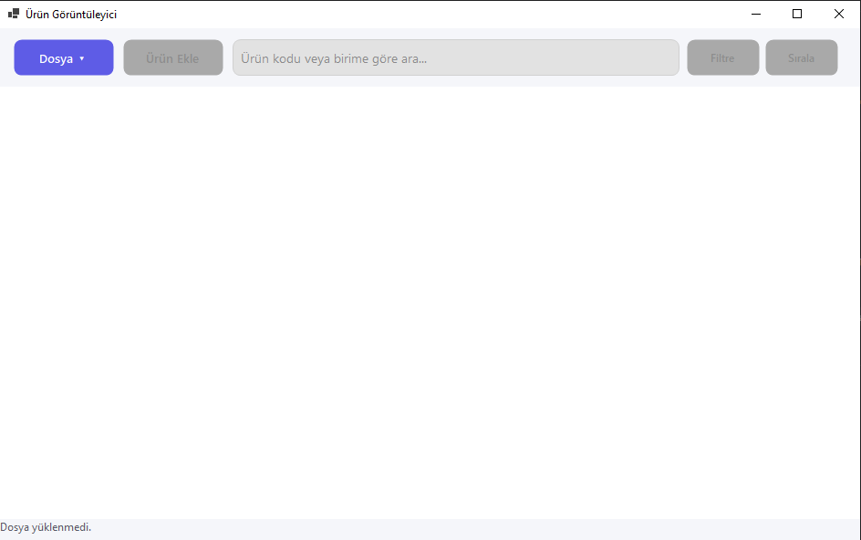
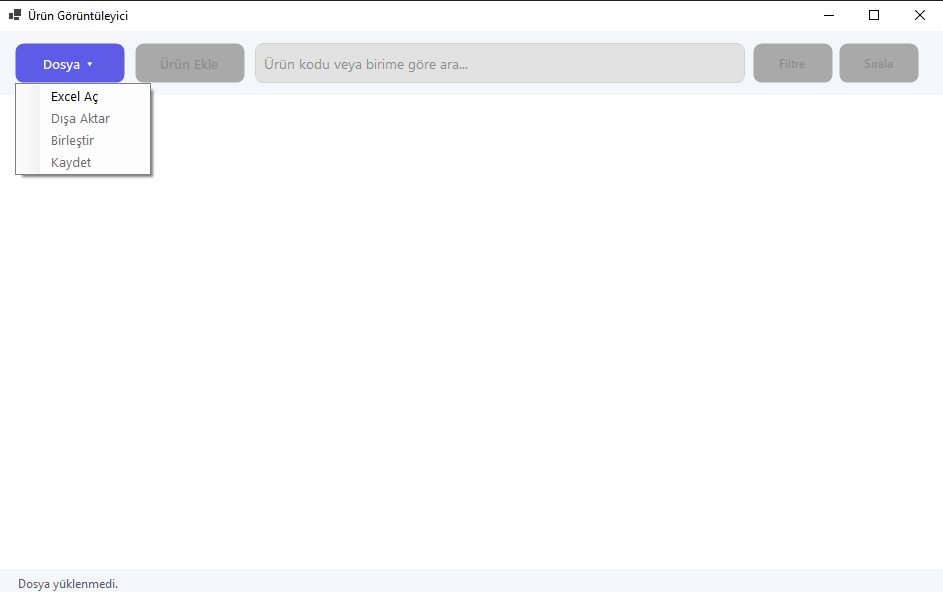
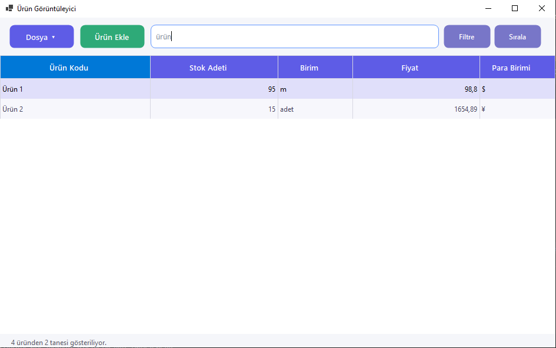
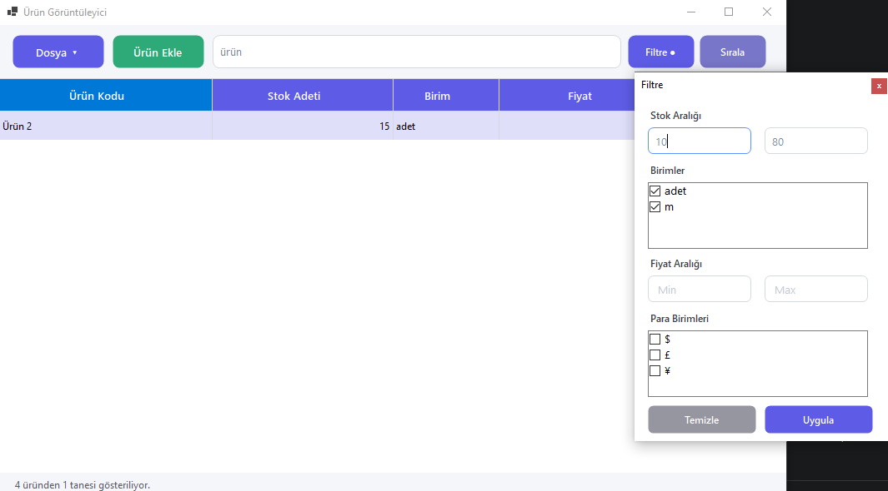
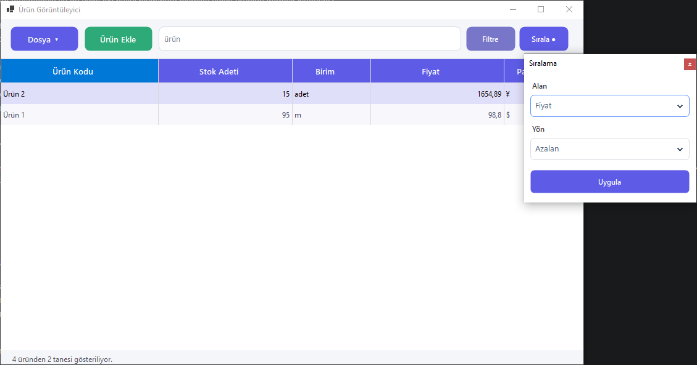
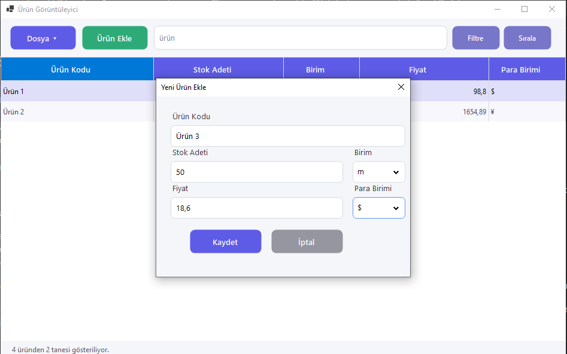
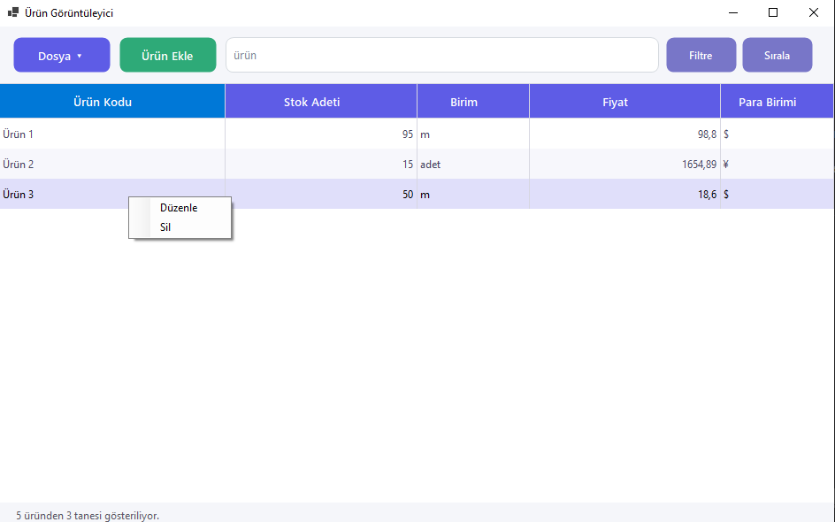
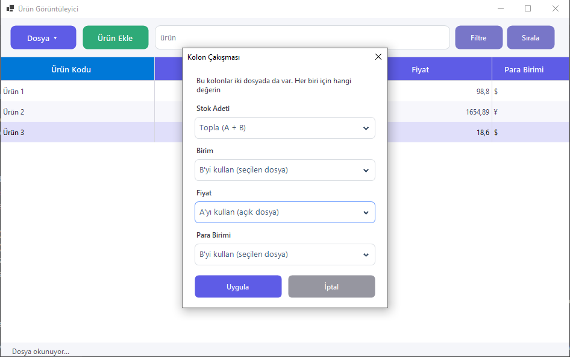

# Ürün Görüntüleyici — Kullanım Kılavuzu

Bu kılavuz, programı ilk kez kullanacak kişiler içindir. Adım adım, sade bir dille anlatılmıştır. Herhangi bir teknik bilgiye ihtiyacınız yoktur.

> **Not:** Bu belgedeki `screenshots/...` ile başlayan satırlar birer ekran görüntüsü yer tutucusudur. Görselleri çekip belirtilen konuma eklediğinizde kılavuz tamamlanmış olur.

---

## İçindekiler

1. [Giriş](#giriş)
2. [Uygulamayı Açma](#uygulamayı-açma)
3. [Excel Dosyası Açma](#excel-dosyası-açma)
4. [Ürünleri Görüntüleme ve Arama](#ürünleri-görüntüleme-ve-arama)
5. [Filtreleme](#filtreleme)
6. [Sıralama](#sıralama)
7. [Yeni Ürün Ekleme](#yeni-ürün-ekleme)
8. [Ürün Düzenleme ve Silme](#ürün-düzenleme-ve-silme)
9. [Stok/Fiyat Hesaplama (120-16 gibi)](#stokfiyat-hesaplama-120-16-gibi)
10. [Dışa Aktarma](#dışa-aktarma)
11. [Birleştirme](#birleştirme)
12. [Sık Karşılaşılan Durumlar](#sık-karşılaşılan-durumlar)

---

## Giriş

Bu program, Excel dosyalarındaki ürün ve stok listelerinizi kolayca görüntülemeniz, aramanız, düzenlemeniz ve iki listeyi birleştirmeniz için hazırlanmıştır. Depo, satış veya stok takibiyle ilgilenen herkes kullanabilir; Excel'i tek tek elle düzenlemek yerine tüm işlemleri tek bir pencereden yapabilirsiniz.

---

## Uygulamayı Açma

1. Size verilen **`ExcelViewer.exe`** dosyasına çift tıklayın.
2. Program açıldığında karşınıza boş bir pencere gelir. Üst kısımda **Dosya**, **Ürün Ekle** düğmeleri, bir **arama kutusu**, **Filtre** ve **Sırala** düğmeleri bulunur. Henüz bir dosya açmadığınız için tablo boştur ve alt kısımda "Dosya yüklenmedi." yazar.

---

## Excel Dosyası Açma

1. Sol üstteki **Dosya ▾** düğmesine tıklayın. Küçük bir menü açılır.
2. Menüden **Excel Aç** seçeneğine tıklayın.
3. Açılan pencereden görüntülemek istediğiniz Excel dosyasını (`.xlsx` uzantılı) seçip **Aç**'a basın.
4. Dosya yüklendiğinde ürünler tabloda listelenir ve alt kısımda kaç ürünün yüklendiği yazar.

> **İpucu:** Dosyanızda her sütun bulunmak zorunda değildir. Programın tanıyabildiği sütunlar (Ürün Kodu, Stok Adeti, Birim, Fiyat, Para Birimi) tabloda gösterilir; dosyanızda olmayan sütunlar otomatik gizlenir. Yalnızca **Ürün Kodu** sütunu zorunludur; bu sütun bulunamazsa dosya açılamaz ve bir uyarı görürsünüz. Bir dosyada bazı sütunlar eksikse, ilk açılışta hangi sütunların bulunamadığını belirten bir bilgi penceresi çıkar.

---

## Ürünleri Görüntüleme ve Arama

Dosya açıldıktan sonra tüm ürünler tabloda görünür. Aradığınız bir ürünü hızlıca bulmak için:

1. Üstteki **arama kutusuna** (içinde "Ürün kodu veya birime göre ara..." yazan kutu) aramak istediğiniz metni yazın.
2. Yazdıkça tablo kendiliğinden süzülür; yalnızca yazdığınız metni **ürün kodunda** veya **biriminde** içeren ürünler kalır.
3. Aramayı temizlemek için kutuyu boşaltın; tüm ürünler yeniden görünür.

Büyük/küçük harf farkı önemli değildir ("KABLO" ile "kablo" aynı sonucu verir).

---

## Filtreleme

Belirli bir stok veya fiyat aralığındaki ya da yalnızca belirli birim/para birimine sahip ürünleri görmek isterseniz:

1. Sağ üstteki **Filtre** düğmesine tıklayın. Küçük bir filtre paneli açılır.
2. Panelde şunları belirleyebilirsiniz:
   - **Stok** için en az ve en fazla değer
   - **Fiyat** için en az ve en fazla değer
   - Görmek istediğiniz **birim(ler)**
   - Görmek istediğiniz **para birim(ler)i**
3. İstediğiniz alanları doldurup onayladığınızda tablo yalnızca bu koşullara uyan ürünleri gösterir.
4. Bir kutuyu boş bırakırsanız o koşul uygulanmaz (örneğin yalnızca en az stok yazarsanız, üst sınır olmaz).

Bir filtre etkinken **Filtre** düğmesinin üzerinde küçük bir nokta (●) belirir; böylece filtrenin açık olduğunu anlarsınız. Filtreyi kaldırmak için paneli açıp değerleri temizleyin.

---

## Sıralama

Ürünleri belirli bir sütuna göre sıralamak için:

1. Sağ üstteki **Sırala** düğmesine tıklayın. Sıralama paneli açılır.
2. Hangi sütuna göre sıralamak istediğinizi seçin (Ürün Kodu, Stok Adeti, Birim, Fiyat veya Para Birimi).
3. Sıralama yönünü seçin: **artan** (küçükten büyüğe / A'dan Z'ye) veya **azalan** (büyükten küçüğe / Z'den A'ya).
4. Onayladığınızda tablo seçtiğiniz düzene göre yeniden dizilir.

Sıralama etkinken **Sırala** düğmesinin üzerinde de küçük bir nokta (●) görünür.

> **Bilgi:** Arama, filtre ve sıralama birlikte çalışır. Önce arama uygulanır, sonra filtre, en son sıralama. İstediğiniz kadarını aynı anda kullanabilirsiniz.

---

## Yeni Ürün Ekleme

1. Üstteki **Ürün Ekle** düğmesine tıklayın. Küçük bir form açılır.
2. Sırasıyla şu alanları doldurun:
   - **Ürün Kodu** (zorunlu)
   - **Stok Adeti** ve yanındaki **Birim**
   - **Fiyat** ve yanındaki **Para Birimi**
3. Birim ve Para Birimi kutularında hazır seçenekler vardır; listeden seçebilir ya da kendiniz yeni bir değer yazabilirsiniz.
4. **Kaydet** düğmesine basın. Ürün Excel dosyanıza eklenir ve tabloya yansır.

**Otomatik doldurma:** Girdiğiniz ürün kodu dosyada zaten varsa, program o ürünün **Birim** ve **Para Birimi** bilgisini otomatik doldurur ve bu iki alanı düzenlenemez hâle getirir; böylece aynı ürün için farklı birim girmiş olmazsınız.

**Aynı kod zaten varsa (çakışma):** Kaydet'e bastığınızda aynı ürün kodu dosyada bulunuyorsa program size ne yapmak istediğinizi sorar:
- **Evet →** Mevcut stok, yeni girdiğiniz değerle **değiştirilir**.
- **Hayır →** Yeni girdiğiniz stok, **mevcut stokun üzerine eklenir** (örneğin eldeki 10 + yeni 5 = 15).
- **İptal →** Hiçbir şey yapılmaz, işlem durur.

Ayrıca: Stok negatif olamaz, fiyat negatif olamaz. Birim **adet** ise stok tam sayı olmalıdır (örneğin 3,5 adet girilemez); metre gibi birimlerde ondalıklı değer (örneğin 12,5) girebilirsiniz.

---

## Ürün Düzenleme ve Silme

**Düzenlemek için:**
1. Tablodaki bir ürünün üzerine **çift tıklayın** (ya da satıra **sağ tıklayıp** açılan menüden **Düzenle** seçin).
2. Açılan formda alanlar o ürünün mevcut bilgileriyle dolu gelir. İstediğiniz değeri değiştirin.
3. **Kaydet**'e basın; değişiklik dosyaya yazılır. Düzenleme sırasında Ürün Kodu dâhil tüm alanları serbestçe değiştirebilirsiniz.

**Silmek için:**
1. Silmek istediğiniz ürüne **sağ tıklayın** ve açılan menüden **Sil** seçin.
2. Program "Bu işlem geri alınamaz, devam edilsin mi?" diye sorar. **Evet** derseniz ürün dosyadan silinir.

---

## Stok/Fiyat Hesaplama (120-16 gibi)

Stok Adeti veya Fiyat alanına doğrudan bir sayı yazabileceğiniz gibi, **artı ve eksi ile küçük bir hesap** da yazabilirsiniz. Bu, elinizde bir toplam varken kafadan hesap yapmadan giriş yapmanızı sağlar.

**Örnekler:**
- Stok kutusuna `120-16` yazıp **Kaydet**'e basarsanız, program bunu hesaplayıp **104** olarak kaydeder.
- `50+25` yazarsanız **75** olur.
- `120-16+5` yazarsanız **109** olur.

Önemli noktalar:
- Hesaplama yalnızca **Kaydet**'e bastığınızda yapılır. Formda gezinirken yazdığınız ifade olduğu gibi durur.
- Yalnızca toplama (`+`) ve çıkarma (`-`) desteklenir. Çarpma, bölme veya parantez çalışmaz.
- Yarım kalmış bir ifade (örneğin `120-`) geçerli sayılmaz; bu durumda program sizi uyarır ve düzeltmenizi ister.

---

## Dışa Aktarma

Tabloda o an gördüğünüz listeyi (arama, filtre ve sıralama uygulanmış hâliyle) ayrı bir Excel dosyası olarak kaydedebilirsiniz. Bu işlem **açık olan dosyanızı değiştirmez**, yeni bir dosya oluşturur.

1. **Dosya ▾** düğmesine tıklayın.
2. Menüden **Dışa Aktar** seçeneğine tıklayın.
3. Açılan pencerede dosyaya bir ad verin ve kaydedeceğiniz yeri seçip **Kaydet**'e basın.
4. O an ekranda görünen ürünler yeni Excel dosyasına yazılır.

> **İpucu:** Örneğin yalnızca stoğu 10'un altındaki ürünleri filtreleyip dışa aktarırsanız, yeni dosyada sadece o ürünler bulunur.

---

## Birleştirme

İki ayrı Excel dosyasını tek bir listede birleştirebilirsiniz. Açık olan dosyanız (A) ile seçeceğiniz ikinci dosya (B) **Ürün Kodu** üzerinden eşleştirilir:
- A'da eksik olan bir bilgi B'de varsa, o bilgi B'den tamamlanır.
- B'de olup A'da hiç bulunmayan ürünler listeye yeni satır olarak eklenir.

**Adımlar:**
1. Birleştirmek istediğiniz ilk dosyayı normal şekilde açın.
2. **Dosya ▾** düğmesine tıklayıp **Birleştir** seçeneğine basın.
3. Açılan pencereden ikinci Excel dosyasını (B) seçin.
4. Eğer iki dosyada da aynı sütun doluysa (örneğin ikisinde de Fiyat varsa), program hangi değerin geçerli olacağını sorar. Her sütun için şunlardan birini seçersiniz:
   - **A'yı kullan** (açık dosyadaki değer)
   - **B'yi kullan** (seçtiğiniz dosyadaki değer)
   - **Topla** (yalnızca Stok Adeti için; iki dosyadaki stoklar toplanır)

   Bu ekranda her sütun için **başlangıçta "B'yi kullan" seçili gelir**; dilediğiniz gibi değiştirebilirsiniz.
5. Seçiminizi yapıp **Uygula**'ya basın.
6. Program sonucu **yeni bir dosyaya** kaydetmenizi ister; ad verip kaydedin. Ardından birleşmiş liste ekranda görünür ve kaç ürünün tamamlandığı, kaç yeni ürün eklendiği bir özet penceresiyle bildirilir.

Bu işlem sırasında **ne A ne de B dosyanız değiştirilir**; sonuç her zaman ayrı, yeni bir dosyaya yazılır.

> **Vazgeçmek isterseniz:** Sütun seçim ekranında **İptal**'e basarsanız hiçbir dosya oluşturulmaz ve "Birleştirme iptal edildi." bilgisini görürsünüz.

---

## Sık Karşılaşılan Durumlar

**S: Ürün kaydetmeye/silmeye çalıştım ama "dosya açık" diye uyarı aldım. Ne yapmalıyım?**
C: Değiştirmek istediğiniz Excel dosyası aynı anda başka bir programda (örneğin Excel'in kendisinde) açıksa, program dosyaya yazamaz. O dosyayı Excel'de kapatın ve işlemi (Kaydet veya Sil) tekrar deneyin. Girdiğiniz bilgiler kaybolmaz, form açık kalır.

**S: Dosyamı açmaya çalıştım ama "Ürün Kodu sütunu bulunamadı" gibi bir hata aldım.**
C: Program bir dosyayı açabilmek için en azından bir **Ürün Kodu** sütununa ihtiyaç duyar. Dosyanızın üst satırlarında ürün kodu başlığı bulunan bir sütun olduğundan emin olun (başlık "Ürün Kodu", "Kod", "Stok Kodu" gibi olabilir).

**S: Dosyayı açtım ama bazı sütunlar (örneğin Fiyat) tabloda görünmüyor.**
C: Program yalnızca dosyanızda gerçekten bulunan sütunları gösterir. Fiyat sütunu görünmüyorsa dosyanızda böyle bir sütun tanınmamış demektir. İlk açılışta çıkan bilgi penceresi hangi sütunların bulunamadığını size söyler.

**S: Stok kutusuna 3,5 yazdım ama kabul etmedi.**
C: Birim **adet** olarak seçiliyse stok tam sayı olmalıdır. Ondalıklı bir değer girmek istiyorsanız birimi metre gibi ölçüye çevirin.

**S: Yaptığım değişiklikleri ayrıca "kaydetmem" gerekiyor mu?**
C: Hayır. Her ekleme, düzenleme veya silme işlemi anında Excel dosyanıza yazılır. Ayrı bir kaydetme adımı yoktur.

**S: Filtre veya arama sonucunu kalıcı olarak dosyaya kaydedebilir miyim?**
C: Evet, dolaylı olarak. Ekranda gördüğünüz süzülmüş listeyi **Dışa Aktar** ile yeni bir Excel dosyasına kaydedebilirsiniz. Bu, asıl dosyanızı değiştirmez.

**S: Yanlışlıkla bir ürünü sildim, geri alabilir miyim?**
C: Silme işlemi geri alınamaz. Bu yüzden silmeden önce program size onay sorar. Emin değilseniz **Hayır** deyin.
